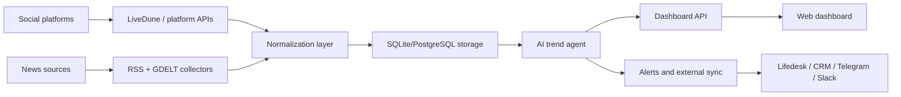

# University Social Trends Intelligence Dashboard

## Цель

Дашборд отслеживает новости, социальные сигналы и тренды, релевантные университетскому сектору: образование, наука, студенческая жизнь, исследования, карьера, admissions, международные партнерства и репутация KAU.

## Текущий Статус Реализации

Уже реализовано:
- локальный dashboard на `http://127.0.0.1:8899`;
- LiveDune API integration через `access_token`;
- получение LiveDune accounts через `GET /accounts`;
- получение аналитики через `GET /accounts/{accountId}/analytics`;
- сравнение KAU с университетами-конкурентами;
- мониторинг новостей и упоминаний KAU;
- AI trend agent с классификацией тем;
- скрытое хранение ключей в `.env`;
- SQLite storage.

## Основные Компоненты

### 1. Data Connectors

LiveDune:
- Instagram, TikTok, LinkedIn dashboards.
- Метрики: followers, ER, posts, likes, comments, views, reposts/shares.
- Используется как основной источник social analytics.

News/RSS/GDELT:
- Google News RSS.
- GDELT global news search.
- Используется для внешних новостей, PR-сигналов, упоминаний KAU и рынка образования.

Kazakhstan media sources:
- Tengrinews: `https://tengrinews.kz/news.rss`
- NUR.kz: `https://www.nur.kz/rss/all.rss`
- Zakon.kz: HTML fallback from `https://www.zakon.kz/`
- Informburo: `https://informburo.kz/rss/pubsubhubbub-feed.xml`
- Azh.kz: HTML fallback from `https://azh.kz/ru`
- Almaty TV: `https://almaty.tv/news-ru.rss`
- Kapital.kz: `https://kapital.kz/feed`
- BES.media: HTML fallback from `https://bes.media/`
- Total.kz: `https://total.kz/rss`
- 24.kz: `https://24.kz/ru/news?format=feed`
- 24.kz incidents: `https://24.kz/ru/news/incidents?format=feed&type=rss`

Planned social connectors:
- Telegram: Bot API, Telethon, TGStat или Brand Analytics.
- VK: VK API, парсинг публичных сообществ, keyword monitoring.
- Twitter/X: X API, SerpAPI, Brandwatch, Meltwater или Talkwalker.
- LinkedIn: LiveDune для подключенных аккаунтов; для wider listening нужен approved API/social listening vendor.

Lifedesk integration layer:
- Если имеется в виду отдельная платформа Lifedesk, нужен API endpoint, token и схема объектов.
- Если имеется в виду LiveDune, интеграция уже подключена.
- Архитектурно слой называется `external_sync_adapter`: он отправляет нормализованные сигналы, метрики и insights во внешнюю систему без потерь.

### 2. Storage

MVP:
- SQLite `data.sqlite`.

Production:
- PostgreSQL.
- Tables:
  - `news_items`
  - `social_metrics`
  - `trend_snapshots`
  - `source_runs`
  - `sync_events`
  - `alerts`

### 3. AI Trend Agent

Задачи агента:
- классифицировать темы по университетскому сектору;
- определять `rising`, `stable`, `emerging`, `declining`;
- объяснять, почему тема важна;
- определять, кто обсуждает тему;
- прогнозировать развитие;
- предлагать действия для контента, PR, admissions и partnerships.

В MVP агент rule-based:
- keyword/topic taxonomy;
- relevance scoring;
- competitor ER context;
- template insights.

Production agent:
- OpenAI API для topic clustering, sentiment, executive insights;
- embeddings for deduplication and semantic trend grouping;
- anomaly detection по росту mentions/ER/views.

### 4. Dashboard Views

LiveDune обзор:
- summary cards;
- KAU own accounts;
- competitor account coverage;
- LiveDune connection status.

Мои аккаунты:
- KAU Instagram, TikTok, LinkedIn;
- followers, ER, posts, interactions;
- platform-level rows.

Сравнение:
- KAU vs competitors;
- followers, ER, posts, interactions;
- status per row.

Тренды соцсетей:
- topic cards;
- mentions;
- relevance;
- trend class;
- audience;
- forecast;
- recommended action.

Казахстан СМИ:
- source cards by media outlet;
- short digest per source;
- top headlines;
- theme extraction for education, career, science/tech, society, economy and incidents;
- recommendations for KAU communications.

Рынок и новости:
- news stream;
- filters by tags;
- sources and topic bars.

Упоминания KAU:
- brand/reputation monitoring;
- direct mentions of KAU and variants.

## Data Flow



## Update Frequency

MVP:
- manual refresh through dashboard button;
- local script launch through `OPEN_DASHBOARD.cmd`.

Production:
- news: every 15-30 minutes;
- LiveDune analytics: every 1-3 hours;
- competitor daily summary: once per day;
- urgent mentions: every 5-15 minutes;
- executive digest: daily/weekly.

## Required Keys

Already configured:
- `LIVEDUNE_API_TOKEN`

Optional:
- `OPENAI_API_KEY`
- `SERPAPI_KEY`
- `GOOGLE_API_KEY`
- `GOOGLE_CSE_ID`
- `NEWS_API_KEY`
- `TELEGRAM_BOT_TOKEN`
- `TELEGRAM_CHAT_ID`
- `LIFEDESK_API_TOKEN`
- `LIFEDESK_BASE_URL`

## Implementation Steps

1. Confirm all KAU and competitor accounts in LiveDune.
2. Keep `account_id` values in `config.example.json`.
3. Run collection:

```powershell
python -m src.kau_agent.main collect --config config.example.json
```

4. Open dashboard:

```powershell
.\OPEN_DASHBOARD.cmd
```

5. Use dashboard:
- LiveDune обзор
- Мои аккаунты
- Сравнение
- Тренды соцсетей
- Рынок и новости
- Упоминания KAU

6. For Lifedesk sync:
- provide API docs, base URL and token;
- map payload fields;
- create retry-safe sync table;
- add `/api/sync/lifedesk` or scheduled push job.

## Stability Requirements

To avoid data loss:
- every API response is stored before analysis;
- sync events are recorded with status;
- failed requests are stored as `livedune_error`;
- external sync should be idempotent by `source_id + timestamp`;
- dashboard reads from storage, not directly from external APIs.

## Production Enhancements

- PostgreSQL migration.
- Background scheduler.
- OpenAI-powered trend clustering.
- Telegram/VK/X connectors.
- Alert routing.
- Role-based dashboard access.
- Export to PDF/PPTX for leadership.
- Historical trend charts.
- Real-time websocket updates.
